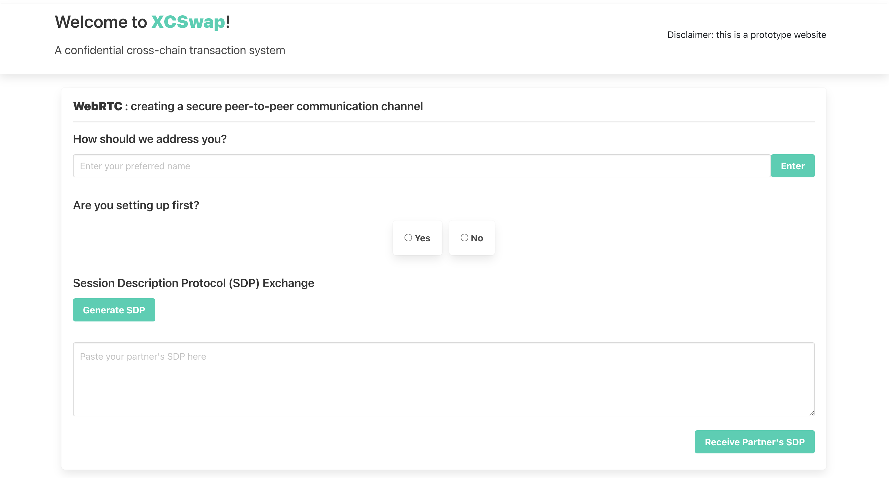

# Dependencies

```
npm install parcel web3@1.10.0
```

# Instructions
```
npm run start
```
The script will start a web server running the client on `http://localhost:1234`.

## Two-Party Single-Token Swap

To simulate two-party swap on a single machine, execute the above command in two terminals. The second instance will run on a different port `http://localhost:xxxxx`.

To simulate cross-browser communication, open the two servers from separate browsers, e.g. [Chrome](https://www.google.com/intl/en_au/chrome/) and [Edge](https://www.microsoft.com/en-us/edge?form=MA13IT).

You should see a welcome page look like below.


Follow our video walkthough or screenshots for a complete simulation of a two-party single-token swap.